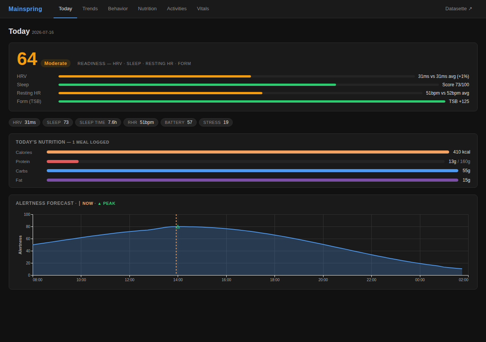
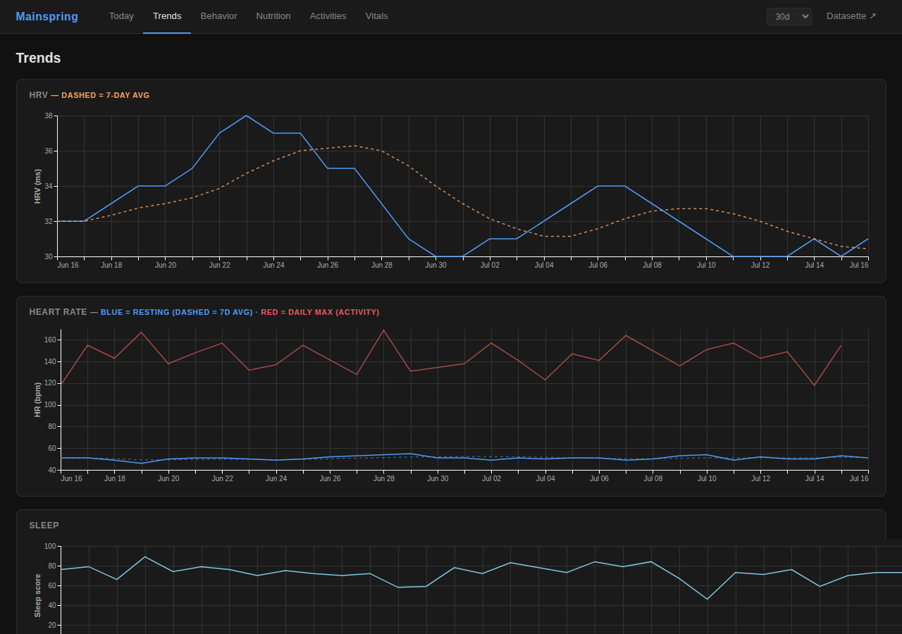
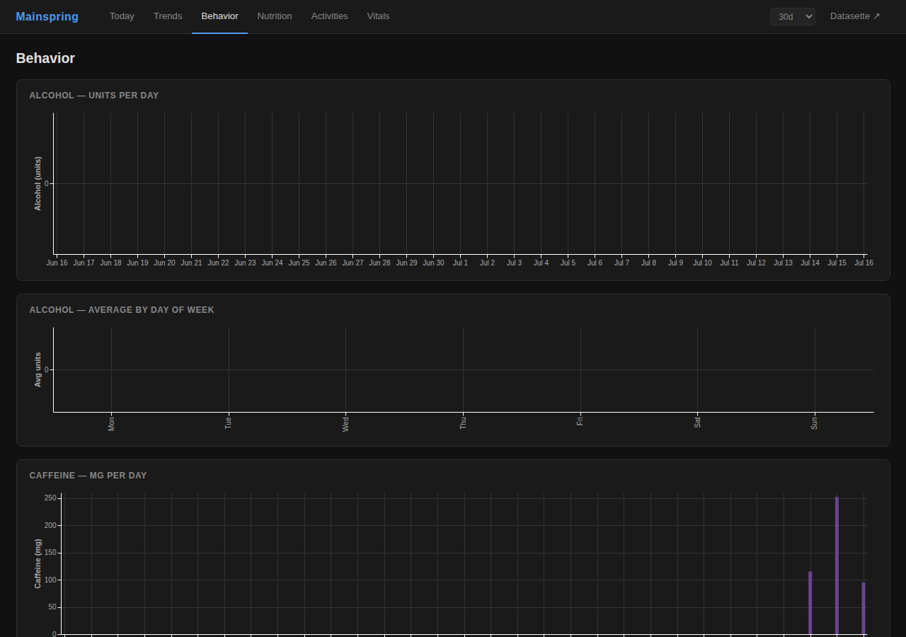
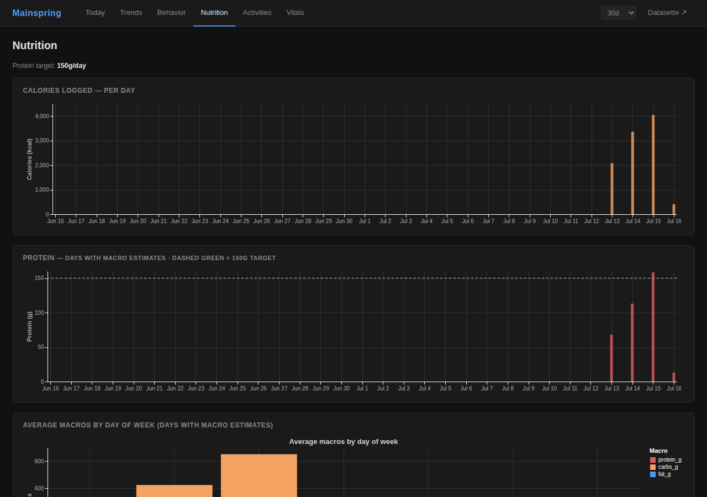

# Mainspring

A self-hosted personal health data service. Ingests biometrics from Garmin and Google Health, accepts manual nutrition/caffeine/alcohol logs via Claude (MCP), and exposes a dashboard for trend analysis and behavior-to-recovery correlations.

Everything runs in a single Docker container with a single SQLite file — no external database, no cloud dependency by default.

---

## Screenshots

### Today — readiness score + alertness forecast



### Trends — HRV, sleep, training load, resting HR



### Behavior — alcohol & caffeine vs. HRV delta



### Nutrition — calories and macros over time



---

## Quick start

**Prerequisites:** Docker + Docker Compose, `openssl` on your PATH.

```bash
git clone https://github.com/danmarg/mainspring
cd mainspring

# 1. Generate .env with random bearer tokens
bash scripts/generate_config.sh

# 2. Set HOME_TZ and add Garmin credentials (see Garmin setup below)
$EDITOR .env

# 3. Start
docker compose up -d

# 4. Open the dashboard — authenticate with DATASETTE_TOKEN from .env
open http://localhost:8080/dashboard
```

The importer service runs both importers once per hour. Unconfigured sources are silently skipped.

---

## Configuration

All config lives in `.env`. See `.env.example` for the full reference.

### Required

| Variable | Purpose |
|---|---|
| `ADMIN_TOKEN` | Import endpoints (`/admin/import/*`) |
| `DATASETTE_TOKEN` | Dashboard login + Datasette SQL explorer |
| `EXPORT_TOKEN` | `/export/db` snapshot download |
| `HOME_TZ` | IANA timezone name, e.g. `America/New_York` |

`scripts/generate_config.sh` generates a `.env` with random tokens for the first three.

### Garmin setup

Two auth methods — pick one:

**Option A — session tokens (recommended, avoids 2FA friction):**

```bash
python3 -c "
from garminconnect import Garmin
g = Garmin()
g.login('your@email.com', 'password')
print(g.garth.dumps())
"
```

Paste the printed JSON string as `GARMINTOKENS` in `.env`. Tokens are long-lived; re-run if they expire.

**Option B — email + password:**

```env
GARMIN_EMAIL=your@email.com
GARMIN_PASSWORD=secret
```

This may fail if Garmin requires 2FA for your account.

### Google Health setup (optional)

Google Health adds sleep stages and other metrics not available from Garmin directly. Skip this if you only have a Garmin device.

1. Go to [Google Cloud Console](https://console.cloud.google.com) → APIs & Services → Credentials
2. Create an **OAuth 2.0 Client ID** (type: Web application)
3. Add an authorized redirect URI:
   - Local: `http://localhost:8080/google_health_callback`
   - Remote: `https://your-domain/google_health_callback`
4. Copy the client ID and secret into `.env`:
   ```env
   GOOGLE_CLIENT_ID=...
   GOOGLE_CLIENT_SECRET=...
   ```
5. Complete the OAuth flow:
   ```bash
   python scripts/google_health_get_tokens.py \
     --base-url http://localhost:8080 \
     --token $ADMIN_TOKEN
   ```
   This opens a browser window, completes the OAuth consent, and stores the tokens in the app's database. Re-run to refresh.

### Optional features

| Feature | Env var(s) required |
|---|---|
| MCP server (Claude nutrition logging) | `MCP_TOKEN` |
| Litestream real-time DB backup | `LITESTREAM_REPLICA_URL` |
| Fitbit | `FITBIT_CLIENT_ID`, `FITBIT_CLIENT_SECRET` |

**Litestream** replicates the SQLite database to S3/B2/R2 in real time. Set `LITESTREAM_REPLICA_URL` in `.env`:

```env
# Backblaze B2:
LITESTREAM_REPLICA_URL=s3://mybucket/health.db?endpoint=https://s3.us-east-005.backblazeb2.com&access-key-id=KEY&secret-access-key=SECRET

# AWS S3 (uses default credential chain):
LITESTREAM_REPLICA_URL=s3://mybucket/health.db
```

---

## Manual imports

Imports run automatically every hour via the `importer` service. To trigger one immediately:

```bash
# Garmin
curl -X POST http://localhost:8080/admin/import/garmin \
  -H "Authorization: Bearer $ADMIN_TOKEN"

# Google Health
curl -X POST http://localhost:8080/admin/import/google_health \
  -H "Authorization: Bearer $ADMIN_TOKEN"
```

Each import pulls a rolling 7-day window to catch late-arriving Garmin corrections (HRV, sleep scores).

---

## Dashboard pages

| Page | URL | What it shows |
|---|---|---|
| Today | `/dashboard` | Readiness score, info strip, today's nutrition, alertness forecast |
| Trends | `/dashboard/trends` | HRV, sleep, training load, resting HR, body battery over time |
| Behavior | `/dashboard/behavior` | Alcohol and caffeine per day + DoW averages; HRV delta diverging bars |
| Nutrition | `/dashboard/nutrition` | Calories and macros per day, DoW macro averages |
| Activities | `/dashboard/activities` | Activity log table |
| Vitals | `/dashboard/vitals` | Blood oxygen, respiration, weight |

The time range selector (7d / 30d / 90d / 180d / 360d) persists across page navigation.

Datasette (raw SQL over all tables) is available at `/datasette`, gated by the same `DATASETTE_TOKEN`.

---

## Architecture

- **Single SQLite file** at `DB_PATH` (default `/data/health.db`), WAL mode
- **FastAPI** app serves the dashboard, admin import routes, optional MCP server, and Datasette
- `raw_import_payloads` — append-only landing zone written before any parsing; everything else is derived and replayable
- `raw_daily_metrics(date, source, metric, value)` — provider-agnostic EAV table; adding a new source = new rows, no schema change
- `daily_metrics` — normalized wide table rebuilt after each import; this is what the dashboard queries
- `manual_logs` — write target for all MCP nutrition/caffeine/alcohol logging tools

---

## Deploying to Fly.io

The `fly.toml` and `deploy.sh` deploy to [Fly.io](https://fly.io). This is optional — Docker Compose is the primary path.

```bash
fly auth login
fly apps create mainspring       # or your own name
fly volumes create health_data --size 10 --region iad

# Mirror your .env as Fly secrets:
fly secrets set \
  ADMIN_TOKEN=... \
  DATASETTE_TOKEN=... \
  EXPORT_TOKEN=... \
  HOME_TZ=Europe/Berlin \
  GARMINTOKENS='...' \
  GOOGLE_CLIENT_ID=... \
  GOOGLE_CLIENT_SECRET=...

./deploy.sh
```

`deploy.sh` also updates the hourly scheduler machine. The app auto-stops when idle; the scheduler uses the public URL so the Fly proxy wakes it on each import run.

